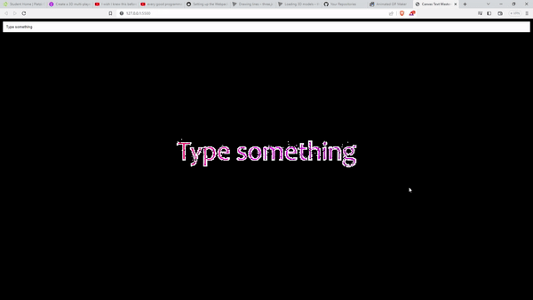

# Particle effects with vanilla JS



## How to use it

first clone this repository

```git clone git@viudanegra```

then, open the __index.html__ with your chosen browser, and play until you get enough of it.
